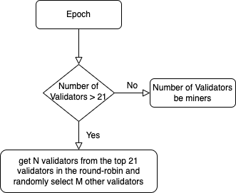

# BEP-131: Introduce candidate validators onto BSC

- [BEP-131: Introduce candidate validators onto BSC]()
    - [1. Summary](#1-summary)
    - [2. Abstract](#2-abstract)
    - [3. Status](#3-status)
    - [4. Motivation](#4-motivation)
    - [5. Specification](#5-specification)
    - [6. License](#6-license)

## 1. Summary

This BEP introduces candidate validators onto Binance Smart Chain to improve the liveness and robustness of the network.

## 2. Abstract

Binance Smart Chain will introduce more validators, e.g. another 20 inactive validators, into the validator set as backups, which will be called "Candidates".

Candidates will produce blocks and charge gas fees on Binance Smart Chain mainnet, but in a much less chance than the official validator set of 21 elected. A decent motivation is expected to be maintained so that the candidate validators are willing to ensure the quality and help secure Binance Smart Chain. 

## 3. Status

This BEP is a draft.

## 4. Motivation

In order to decentralize the network further, more validators should be introduced. Besides increasing the anti-censorship, it always increases the robustness and availability of the network. Binance Smart Chain should survive even if more than half of the validator set were censored or taken down in a hostile way.

Meanwhile, Binance Smart Chain has 21 active validators and many inactive validators. The inactive validators have no reward so the incentive for the runner to ensure the node quality and the delegation from the BNB holders are not enough. 

## 5. Specification

### 5.1 Overview


In the current version, the BSC validator set is determined by its staking and delegation logic, via a staking module built on BC for BSC, and propagated every day UTC 00:00 from BC to BSC via Cross-Chain communication.

Based on this implementation, the Binance Chain can propagate more validators to BSC, and Binance Smart Chain can adopt a flexible strategy to choose working validators from both the top 21 staked active validators and less staked candidates for each epoch.

In this way, the robustness and liveness of the Binance Smart Chain can be improved, and more validator operators will be motivated to join.

Following is a simple diagram to explain the workflow of the validator setting and getting.  Usually, M is smaller than N so that candidates get less chance to propose blocks. 


### 5.2 Roles
  1. Active
    The top 21 staked validators, get the most chance to produce blocks. 
  2. Candidate
    The top (21, 21+ `MaxNumOfCandidates`]  staked validators, get a small chance to produce blocks.
  3. Inactive
    The rest validators get no chance to produce validators.

### 5.3 Cross Chain Package
Binance Chain will send the active and candidate validator set information to the validator contract on Binance Smart Chain every day through the cross-chain package.

### 5.4 Election


During the consensus process, Binance Smart Chain will reacquire 21 new validator sets in the validator contract every epoch. On this basis, the randomness of the validator is increased so that more validators can get the chance to generate blocks.

### 5.4.1 Governance
The following parameters can be governed: 
  1. `MaxNumOfCandidates`:  The max number of candidates can be elected each day on the Binance Chain Staking module.
  2.  `MaxNumOfWorkingCandidates`: The max number of candidates can be randomly selected to be working validators for each epoch on the Binance Smart Chain.

### 5.4.2 How to elect miners?
The top 21 validators will select N validators at a time by the round-robin, subtract N validators from the total number of validators that have been selected, randomly select M validators, and finally get a group of 21 validators formed.

#### RoundRobin + Random
Each time top 21 validators will be selected by a round-robin, and others validators will be selected randomly.

e.g.
```
Validator Set = [1,2,3,4,5,6,7,8,9,10,11,12,13,14,15,16,17,18,19,20,21,22,23,24,25,26,27,28]
MaxNumOfWorkingCandidates = 2

Validator Set 1 = [1,2,3,4,5,6,7,8,9,10,11,12,13,14,15,16,17,18,19,24,30]
Validator Set 2 = [2,3,4,5,6,7,8,9,10,11,12,13,14,15,16,17,18,19,20,1,28]
```

#### Randomness
In order to ensure that the random number factor can not be manipulated, `epochNumber = BlockHeight / 200`is chosen as the random number factor. `epochNumber` is a  fixed value within one epoch and is incremental across the epoch.

#### Edge Case
  1. When the total number of validators is only 21, the random selection rule will not be applied.

### 5.5 Security
A higher staked validator is more trustworthy. Based on this assumption, we let the Top 21 validators generate blocks in turn to maintain a certain degree of security, and the other validators are randomly selected to ensure that these validators will not collude and cause damage to the overall network.

### 5.6 Liveness
In addition to active validators, other validators can get the opportunity to generate blocks, and they can get rewards. Through these reward mechanisms, inactive validators can be more motivated to continue to run their nodes.

### 5.7 Robustness
Through the new mechanism, Binance Smart Chain no longer has only 21 validators to generate new blocks but has more candidates to choose from. When any active nodes encounter some problems, they can be replaced by candidates, thereby improving the overall robustness.

## 6. License

The content is licensed under [CC0](https://creativecommons.org/publicdomain/zero/1.0/).
