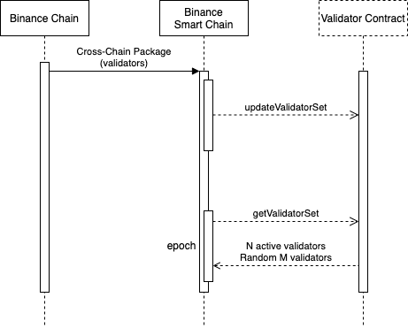

# BEP-131: Increase the liveness and robustness

- [BEP-131: Increase the liveness and robustness]
    - [1. Summary](#1-summary)
    - [2. Abstract](#2-abstract)
    - [3. Status](#3-status)
    - [4. Motivation](#4-motivation)
    - [5. Specification](#5-specification)
    - [6. License](#6-license)

## 1. Summary

This BEP introduces liveness and robustness improvement of Binance Smart Chain.

## 2. Abstract

Binance Smart Chain will introduce more validators, e.g. another 20 inactive validators, into the validator set as backups, which will be called “Candidates”.

Candidates will produce blocks and charge gas fees in Binance Smart Chain mainnet, but in a much less chance than the official validator set of 21 elected. A decent motivation is expected to be maintained so that the candidate validators are willing to ensure the quality and help secure Binance Smart Chain. 

## 3. Status

This BEP is a draft.

## 4. Motivation

In order to decentralize the network further, more validators should be introduced. Besides increasing the anti-censorship, it always increases the robustness and availability of the network. Binance Smart Chain should survive even if more than half of the validator set were censored or taken down in a hostile way.

Meanwhile, Binance Smart Chain has 21 active validators and many inactive validators. The inactive validators have no reward so the incentive for the runner to ensure the node quality and the delegation from the BNB holders are not enough. 

## 5. Specification

### 5.1 Overview

In the current version, the validator address is actually selected by Binance Chain, and Binance Smart Chain will receive a cross-chain package from Binance Chain every day to know which validators can be miners.

Based on this implementation, we let Binance Chain select more validator's addresses to be candidate validators, and Binance Smart Chain can get more options to select the miners.

In this way, the robustness and liveness of the Binance Smart Chain can be improved, and more validator operators will be motivated to join.

### 5.2 Workflow

Here is a simple diagram to explain the workflow of the validator setting and getting.

### 5.3 Roles
  1. Active
    The top N native token staked validators, who get the most chance to produce blocks.
  2. Candidate
    The top (N, M+N] native token staked validators, who get a small chance to produce blocks.
  3. Inactive
    The rest validators get no chance to produce validators.

### 5.4 Cross Chain Package
Binance Chain will send the active and candidate validator set information to the validator contract on Binance Smart Chain every day through the cross-chain package.

### 5.5 Election

During the consensus process, Binance Smart Chain will reacquire 21 new validator sets in the validator contract every epoch. On this basis, the randomness of the validator is increased so that more validators can get the chance to generate blocks.

### 5.5.1 Governance
  1. random_validator_nums
    how many validators will be selected randomly.

### 5.5.2 How to elect miners?
The top 21 validators will select N validators at a time by the round-robin, subtract N validators from the total number of validators that have been selected, randomly select M validators, and finally get a group of 21 validators formed.
#### RoundRobin + Random
Each time top 21 validators will be selected by a round-robin, and others validators will be selected randomly.

e.g.
Validator Set = [1,2,3,4,5,6,7,8,9,10,11,12,13,14,15,16,17,18,19,20,21,22,23,24,25,26,27,28]
random_validator_nums = 2

Validator Set 1 = [1,2,3,4,5,6,7,8,9,10,11,12,13,14,15,16,17,18,19,24,30]
Validator Set 2 = [2,3,4,5,6,7,8,9,10,11,12,13,14,15,16,17,18,19,20,1,28]
…

#### Randomness
In order to ensure that the random number factor is controlled, block.timastamp in epoch is chosen as the random number factor. Even if the timestamp is to be brute-forced, it will be limited by the block time and replaced by other block producers.

#### Edge Case
  1. When the total number of validators is only 21, the random selection rule will not be applied.

### 5.6 Security
We assume that apart from the Top 21 validators, all other validators are not completely trustworthy.

Based on this assumption, we let the Top 21 validators generate blocks in turn to maintain a certain degree of security, and the other validators are randomly selected to ensure that these validators will not collude and cause damage to the overall network.

### 5.7 Liveness
In addition to active validators, other validators can get the opportunity to generate blocks, and they can get rewards. Through these reward mechanisms, inactive validators can be more motivated to continue to run their nodes.

### 5.8 Robustness
Through the new mechanism, Binance Smart Chain no longer has only 21 validators to generate new blocks but has more candidates to choose from. When any N nodes encounter some problems, they can be replaced by other nodes, thereby improving the overall robustness.

## 6. License

The content is licensed under [CC0](https://creativecommons.org/publicdomain/zero/1.0/).
